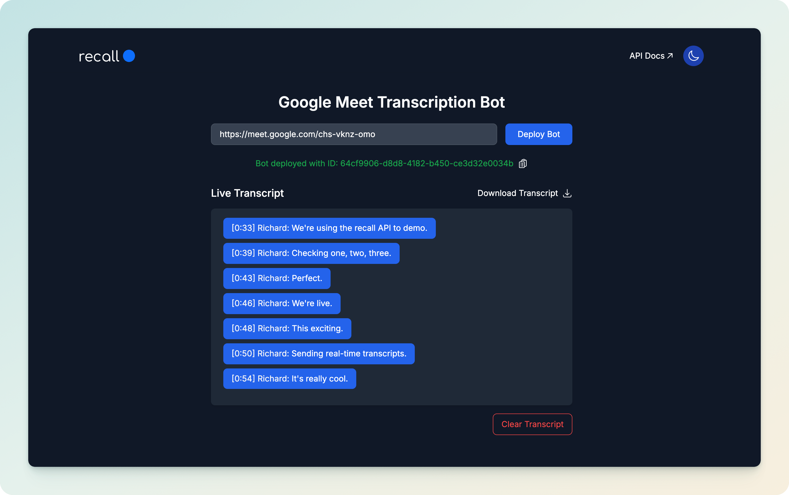

# Google Meet Transcription Bot Demo



## About The Project

A simple app to deploy a bot that joins a Google Meet and transcribes it in real-time. Built with React, Node.js, and Recall.ai, it’s perfect for developers exploring programmatic transcription for notetaking tools.

## Tech Stack
- [**React**](https://react.dev/)
- [**Tailwind**](https://tailwindcss.com/)
- [**Node.js**](https://nodejs.org)
- [**Express.js**](https://expressjs.com/)
- [**Axios**](https://axios-http.com/)
- [**Socket.IO**](https://socket.io/)
- [**cors**](https://www.npmjs.com/package/cors)
- [**ngrok**](https://ngrok.com)

## Get Started
Set up and run the Google Meet Transcription Demo in minutes.

### Prerequisites
- **Recall.ai API Key**: API Key and Webhook endpoint at [Recall.ai](https://recall.ai).
- **ngrok**: To expose the backend - [installation guide](https://ngrok.com).
- **npm**:
```bash
npm intall npm@latest -g
```

### Installation

1. **Clone the Repository**:

   ```bash
   git clone https://github.com/rchrdchn/recall-transcription-demo.git
   cd recall-transcription-demo

2. **Set Up the Backend**:

   ```bash
   cd backend
   npm install

3. **Set Up the Frontend**:

   ```bash
   cd ../frontend
   npm install

4. **Create a backend/.env file and enter your API Key**

  ```bash
  echo -e "RECALL_API_KEY=YOUR_TOKEN_HERE\nWEBHOOK_URL=NGROK_URL\nPORT=BACKEND_PORT" > backend/.env
   ```

  - Your `backend/.env` file should look like this:

   ```bash
    RECALL_API_KEY=YOUR_TOKEN_HERE
    WEBHOOK_URL=NGROK_URL
    PORT=BACKEND_PORT
   ```

5. **Configure ngrok**:

  Run ngrok to expose port 3001:

   ```bash
    cd backend
    ngrok http 3001
   ```

  Note the ngrok URL (e.g. https://1234-56-789-01-234.ngrok-free.app).

### Running the App

1. **Launch the Backend**:

   ```bash
    cd backend
    node index.js
   ```

2. **Launch the Frontend**:

   ```bash
    cd ../frontend
    npm start
   ```

3. **Ensure ngrok is running**

## Demo

1. Go to http://localhost:3000.
2. Enter a Google Meet URL (e.g., https://meet.google.com/abc-defg-hij).
3. Click “Deploy Bot”.
4. Join the Google Meet and admit the bot.
5. Watch live transcripts appear in the [app](http://localhost:3000/).
6. Save transcripts as `transcript.txt` or clear them when done.

### Features

- Deploy bot to join Google Meet.
- Transcribes meeting in real-time.
- Responsive and accessible design (a11y).
- Copy bot ID with a single click.
- Save transcripts as a text file.
- Clear transcripts after your meeting.
- Auto-scrolls smoothly to the latest transcript.
- Toggle dark/light mode.

## Troubleshooting
- **Backend Not Starting**: Check port 3001 is free (lsof -i :3001) and rerun npm install.
- **No Transcripts**: Ensure the Meet URL is valid, the bot is admitted, and the API key is correct.
- **ngrok Errors**: Restart ngrok if the URL expires (_ngrok URL changes every time it restarts_).

## License
This project is licensed under the MIT License. See the [LICENSE](LICENSE) file for details.

## Author
[**Richard Chan**](middlekid.io)